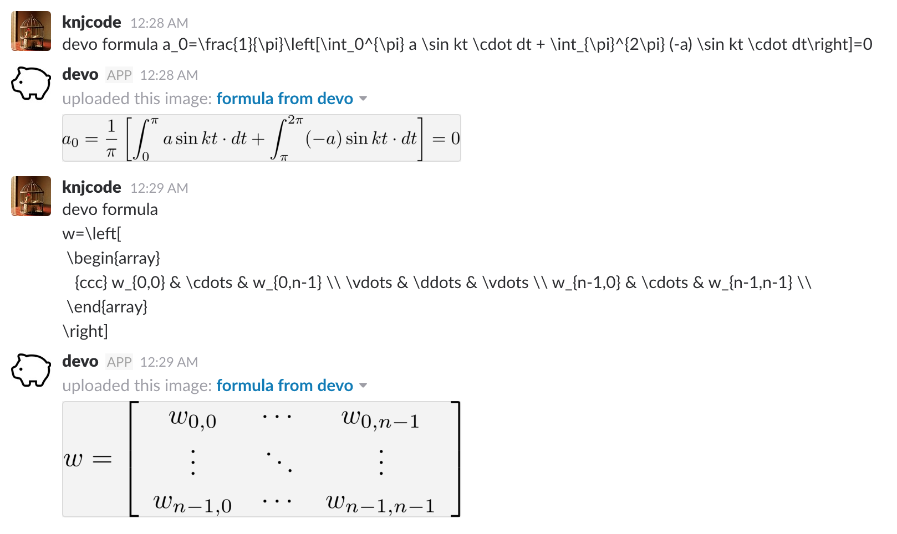

# hubot-slack-latex-formula

A hubot script that creates latex formula images and upload it to Slack.

This script requires envsubst, pdflatex, pdfcrop and convert commands on your system.

## Install system dependencies

Install dependencies on your system.

On Ubuntu

```bash
$ sudo apt-get update
$ sudo apt-get install -y gettext texlive-latex-base texlive-latex-extra texlive-extra-utils \
    texlive-fonts-extra texlive-science imagemagick
```

## Installation

In hubot project repo, run:

```bash
$ npm install knjcode/hubot-slack-latex-formula --save
```

Then add **hubot-slack-latex-formula** to your `external-scripts.json`:

```json
[
  "hubot-slack-latex-formula"
]
```

## Sample Interaction

Input formula text into hubot as below.


